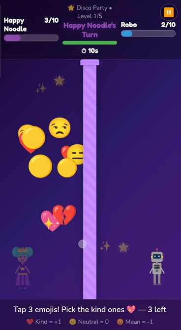

# Kind Emojis Battle 🎮

<p align="center">
  
</p>

A 1–2 player browser game about spreading kindness.

Built with my daughter during half-term, and with a little help from AI, this playful emoji battle lets you create your own character and throw emojis over the wall.

Play against the computer or a friend. First to 10 points wins the level. Win the most levels to win the game.

**Kindness wins. 💕**

The game is built as a Progressive Web App (PWA), so it can be installed and played like a native app.

## Play the Game

https://www.kindemojisbattle.com

## How It Works

Each round, players choose from a mixed pool of 10 emojis:

- Kind emoji = +1 point
- Neutral emoji = 0 points
- Mean emoji = -1 point

Choose carefully. Small choices add up.

## Game Flow

- Create your own character
- Choose from the shared emoji pool
- Take turns throwing emojis
- First to 10 points wins the level
- Progress through 5 levels

## Game Modes

- Single player vs computer
- Two-player local mode

## PWA Features

- Installable on mobile and desktop
- Fast loading
- Works offline after the first visit

## Why We Built It

We wanted to build something fun together that encourages positive choices, creativity and turn-taking. We also wanted to see if we could make our own game from scratch!

## Tech Stack

- React
- Vite
- Service Worker (PWA)
- Deployed via GitHub Pages with a custom domain

## Development

Install dependencies:

```bash
npm install
```

Run locally:

```bash
npm run dev
```

Build and deploy:

```bash
npm run build
npm run deploy
```
